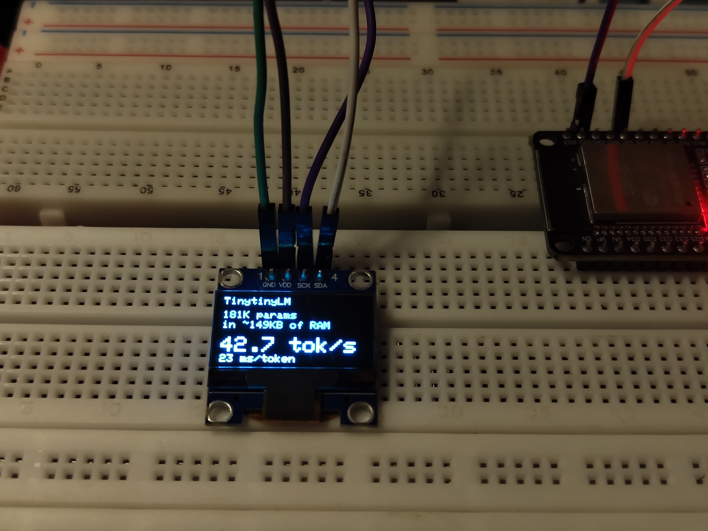

# TinytinyLM — A Tiny Language Model on Plain ESP32

A minimal end-to-end language model running inference on a plain **ESP32-D0WD-V3**
(no PSRAM, no S3-only features) with a 0.96" SSD1306 OLED display. Trained on
TinyStories, exported to a custom binary format, and runs entirely from internal
SRAM at ~20-42 tok/s.




## What This Project Does

1. Trains a small decoder-only transformer on TinyStories
2. Quantizes it to 4-bit int and exports to a flat binary
3. Flashes it to a custom partition on a 4 MB ESP32
4. Runs inference using the ESP32's dual-core CPU
5. Displays generated text and stats on a 128×64 I2C OLED

## Hardware

| Component | Spec |
|-----------|------|
| **Board** | ESP32-D0WD-V3 (dual core, 240 MHz, 4 MB flash, 368 KB heap) |
| **Display** | 0.96" 128×64 I2C OLED (SSD1306) |
| **Serial** | 115200 baud over USB |
| **PSRAM** | None |

### Wiring

| OLED Pin | ESP32 Pin |
|----------|-----------|
| VCC | 3.3V |
| GND | GND |
| SDA | GPIO 21 |
| SCL | GPIO 22 |

## Model Configuration

```
arm:        baseline (no PLE table)
vocab_size: 256 (byte-level BPE tokenizer)
d_model:    64
n_layers:   4
n_heads:    4
ffn_hidden: 128
seq_len:    64
```

| Metric | Value |
|--------|-------|
| Parameters | 180,800 |
| 4-bit size | ~158 KB (model.bin) |
| SRAM used | ~149 KB (KV cache + head + scratch) |
| Free SRAM | ~174 KB (of 323 KB heap) |
| Training data | TinyStories (300 MB slice) |
| Val loss | 1.09 (ppl 2.98) at step 4000 |
| Inference speed | ~20-42 tok/s |

## Quick Start

### 1. Install Python Dependencies

```bash
pip install torch numpy tokenizers requests
```

### 2. Prepare Training Data

```bash
cd data
python prepare.py --vocab 256
```

Downloads TinyStories (~300 MB) and trains a 256-token byte-level BPE tokenizer.

### 3. Train the Model

```bash
cd src
python train.py --arm baseline --vocab 256 --d-model 64 \
  --n-layers 4 --n-heads 4 --seq-len 64 --fixed-ffn 128 \
  --steps 4000 --batch-size 32 --lr 1e-3 --seed 0 --tag tiny
```

Takes ~6 minutes on CPU. Output: `runs/baseline-tiny-s0.pt`

### 4. Export to Binary

```bash
cd src
python export.py baseline-tiny-s0
```

Output: `firmware/model/model.bin` (~158 KB)

### 5. Generate Vocab Header

```bash
cd src
python gen_assets.py
```

Output: `firmware/esp32_llm/vocab.h`

### 6. Build & Flash (Arduino IDE)

1. Open `firmware/esp32_llm/esp32_llm.ino` in Arduino IDE
2. Install libraries: **Adafruit SSD1306**, **Adafruit GFX Library**, **Adafruit BusIO**
3. Board: **ESP32 Dev Module** (`esp32:esp32:esp32`)
4. Port: your COM port (e.g., `COM7`)
5. Upload: `Ctrl+U`

### 7. Flash the Model Partition

Close the Serial Monitor, then in a terminal:

```bash
esptool --chip esp32 --port COM7 --baud 921600 write_flash 0x140000 firmware/model/model.bin
```

### 8. Monitor Output

Open Serial Monitor at 115200 baud. Press the EN/RST button on the ESP32.

You should see:
```
=== TinytinyLM ===
model: V=256 D=64 L=4 H=4 F=128 P=64  (mapped 2.8 MB)
>>> Once upon a time...
```

The OLED displays generated text and a stats card with tok/s and ms/token.

## Flash Layout (4 MB)

| Partition | Offset | Size | Purpose |
|-----------|--------|------|---------|
| nvs | 0x9000 | 20 KB | WiFi/BT config |
| factory | 0x10000 | 1.19 MB | Firmware |
| model | 0x140000 | 2.6 MB | Model binary (int4 quantized) |
| coredump | 0x3E0000 | 128 KB | Crash dumps |

## Repository Structure

```
.
├── data/
│   └── prepare.py              # Download TinyStories, train BPE tokenizer
├── src/
│   ├── model.py                # TinyLM architecture (Config, TinyLM)
│   ├── train.py                # Training loop
│   ├── export.py               # Export to model.bin (int4 quantized)
│   ├── gen_assets.py           # Generate vocab.h for firmware
│   ├── quantize.py             # Group-wise int4 quantization
│   └── budget.py               # Memory tier accounting
├── firmware/
│   ├── common/
│   │   └── llm.h               # Portable C inference engine
│   ├── esp32_llm/
│   │   ├── esp32_llm.ino       # Main firmware (plain ESP32 + OLED)
│   │   ├── display.h           # SSD1306 OLED driver
│   │   ├── partitions.csv      # 4 MB flash layout
│   │   └── vocab.h             # Token → bytes decode table (generated)
│   ├── host_verify/
│   │   ├── verify.c            # Host numerical correctness check
│   │   └── ppl.c               # Host perplexity check
│   └── rp2040_tinylm/          # Earlier RP2040 experiment
├── experiments/                 # Training sweep scripts
├── img/                        # Photos and workflow diagram
├── OPENCODE_CONTEXT.md         # Detailed session context for agents
└── RESULTS.md                  # Original experiment results
```

## Architecture

```
Input tokens
    │
    ▼
┌─────────────────┐
│  Token Embedding │  (256 × 64, tied with output head)
└────────┬────────┘
         │
         ▼
┌─────────────────────────────────┐
│  4 × Transformer Blocks         │
│  ┌───────────────────────────┐  │
│  │ RMSNorm → Attention → +  │  │
│  │ RMSNorm → SwiGLU FFN → + │  │
│  └───────────────────────────┘  │
└────────┬────────┘
         │
         ▼
┌─────────────────┐
│  RMSNorm         │
│  Output Head     │  (256 × 64, int8 staged in SRAM)
└────────┬────────┘
         │
         ▼
    Next token
```

## Key Design Decisions

- **Byte-level tokenizer (vocab 256)**: Every byte is a token. Simple, no special
  vocabulary needed, but the model must learn character-level patterns.
- **No PLE table**: Skipped the Per-Layer Embedding table entirely (baseline arm)
  to minimize flash and SRAM usage.
- **Zero-padded PLE slots**: The C inference engine (`llm.h`) always expects PLE
  tensors in the binary layout. Baseline arm emits zeros for these slots.
- **Tied embeddings**: Input embedding and output head share the same weight
  matrix, halving the parameter count.
- **Int8 output head**: Head weights are staged in SRAM as int8 for faster
  dot-product computation. Dual-core parallelism splits the head rows.
- **Plain malloc**: No PSRAM. All allocations use standard `malloc()`.
- **flash mmap**: Model binary is memory-mapped from flash; only hot tensors
  (KV cache, head, scratch) live in SRAM.

## What Runs Where

| Stage | Where | Tool |
|-------|-------|------|
| Data preparation | PC | `python data/prepare.py` |
| Training | PC (CPU) | `python src/train.py` |
| Export | PC | `python src/export.py` |
| Inference | ESP32 | `esp32_llm.ino` + `llm.h` |
| Display | ESP32 + OLED | `display.h` |

## Credit

- Viacheslav Sierbov / slvDev for the original ESP32-S3 microcontroller LLM work:
  https://github.com/slvDev/esp32-ai
- TinyStories dataset: Ronen Eldan and Yuanzhi Li, Microsoft Research,
  arXiv:2305.07759
- Per-Layer Embeddings from Google's Gemma 3n work
- Andrej Karpathy's `llama2.c` for small LM training and C inference reference

## License

MIT License. See [LICENSE](LICENSE).
