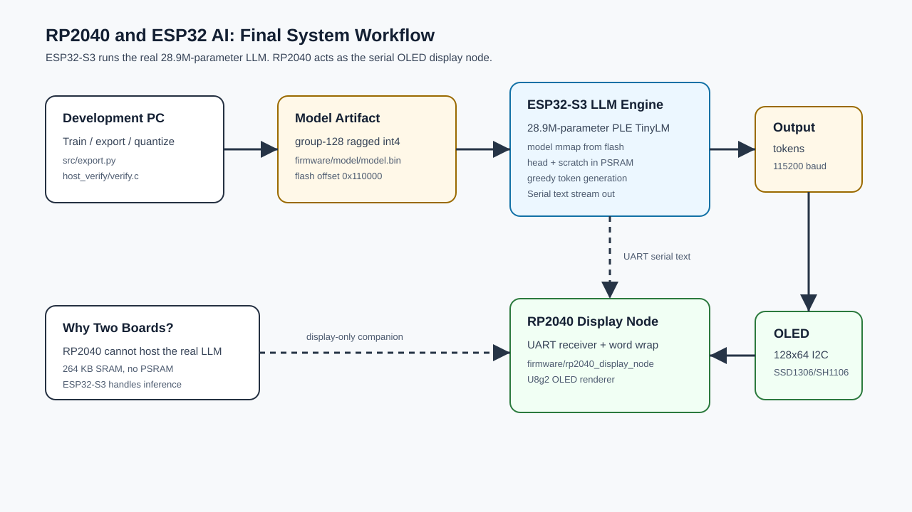

# Running a 28.9M Parameter Model on ESP32 and RP2040

RP2040 and ESP32 AI is a two-board embedded AI demo built around an ESP32-S3
LLM engine and an RP2040 OLED display node. The ESP32-S3 runs the actual
28.9M-parameter PLE TinyLM model, while the RP2040 acts as a lightweight serial
display companion for the generated text.

This repository contains the ESP32-S3 inference firmware, model export and
verification tooling, an RP2040 serial OLED display-node sketch, a workflow
diagram, and demo output images.



## Project Story

I first tried to put the same million-parameter LLM idea directly on the RP2040.
Because the RP2040 only has 264 KB SRAM and no PSRAM, that path was not practical
for the real model. I used a smaller RP2040 alternative, but the output quality
was not strong enough for the final LLM demo.

The final version uses the ESP32-S3 as the actual LLM engine, based on the
`esp32-ai` work by Viacheslav Sierbov / slvDev:

https://github.com/slvDev/esp32-ai

The RP2040 is kept as a display node. It receives generated LLM text over serial
and renders it on the OLED.

## Features

- ESP32-S3 runs the actual 28.9M-parameter PLE TinyLM model
- Model is stored in a custom flash partition and memory-mapped at runtime
- Hot output head and scratch buffers are staged in PSRAM
- Host-side export and verification tools are included
- RP2040 display node receives generated text over UART
- 128x64 I2C OLED output using U8g2 on the RP2040
- Workflow diagram and demo output images included in `img/`
- No cloud API is required for the embedded inference demo

## Repository Structure

```text
.
+-- .gitignore
+-- data/
|   +-- prepare.py
+-- experiments/
|   +-- clean_confirm.sh
|   +-- deploy_seed1.sh
|   +-- overnight.sh
|   +-- run_ablation.sh
|   +-- run_ple_dim_sweep.sh
|   +-- run_seed1.sh
+-- firmware/
|   +-- bandwidth_bench/
|   |   +-- bandwidth_bench.ino
|   +-- common/
|   |   +-- llm.h
|   +-- esp32_llm/
|   |   +-- display.h
|   |   +-- esp32_llm.ino
|   |   +-- partitions.csv
|   |   +-- README.md
|   +-- host_verify/
|   |   +-- ppl.c
|   |   +-- verify.c
|   +-- rp2040_display_node/
|   |   +-- rp2040_display_node.ino
|   +-- rp2040_tinylm/
|   |   +-- README.md
|   |   +-- rp2040_model.h
|   |   +-- rp2040_tinylm.ino
+-- img/
|   +-- IMG_20260817_222228.jpg
|   +-- IMG_20260817_222245.jpg
|   +-- workflow-block-diagram.svg
+-- src/
|   +-- analyze.py
|   +-- budget.py
|   +-- export.py
|   +-- gen_assets.py
|   +-- gen_rp2040_assets.py
|   +-- model.py
|   +-- quantize.py
|   +-- sample.py
|   +-- train.py
+-- CONTRIBUTING.md
+-- LICENSE
+-- README.md
+-- RESULTS.md
+-- pyproject.toml
+-- uv.lock
```

## Firmware Files

- `firmware/esp32_llm/esp32_llm.ino`: ESP32-S3 LLM inference firmware.
- `firmware/esp32_llm/partitions.csv`: custom flash partition layout with the
  `model` partition.
- `firmware/common/llm.h`: portable C inference runtime shared by host and ESP32.
- `firmware/host_verify/verify.c`: host-side numerical correctness check.
- `firmware/host_verify/ppl.c`: host-side perplexity check.
- `firmware/rp2040_display_node/rp2040_display_node.ino`: RP2040 UART-to-OLED
  display node.
- `firmware/rp2040_tinylm/`: earlier RP2040-only TinyLM fallback experiment.
- `src/export.py`: exports the quantized model payload used by the ESP32.
- `img/workflow-block-diagram.svg`: block diagram for the final two-board system.

## System Workflow

The model is trained, exported, and quantized on a development machine, then
verified against the portable C runtime before deployment. On the device side,
the ESP32-S3 firmware loads the model from the custom flash partition,
memory-maps it, stages the hot buffers in PSRAM, and generates text from the
28.9M-parameter PLE TinyLM. The generated text is streamed over UART/Serial to
the RP2040, which receives the stream and renders it on the OLED.

## Hardware Summary

- ESP32-S3 N16R8 or equivalent board with PSRAM
- Raspberry Pi Pico / RP2040 board
- 128x64 I2C OLED display
- USB cable for flashing and monitoring
- UART connection from ESP32 TX to RP2040 RX
- Common ground between ESP32 and RP2040

## Credit

Credit to Viacheslav Sierbov / slvDev for the original ESP32-S3 28.9M-parameter
microcontroller LLM work:

https://github.com/slvDev/esp32-ai

TinyStories is the dataset used for training: Ronen Eldan and Yuanzhi Li,
Microsoft Research, arXiv:2305.07759.

The model uses Per-Layer Embeddings, a technique from Google's Gemma 3n work,
to make a larger model practical on a small chip by keeping most parameters in
flash and reading only the rows needed at each token.

Andrej Karpathy's `llama2.c` is an important reference for training a small
language model and running inference in plain C.


## License

This project is released under the MIT License. See [LICENSE](LICENSE) for the
full terms.
